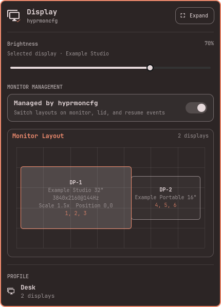
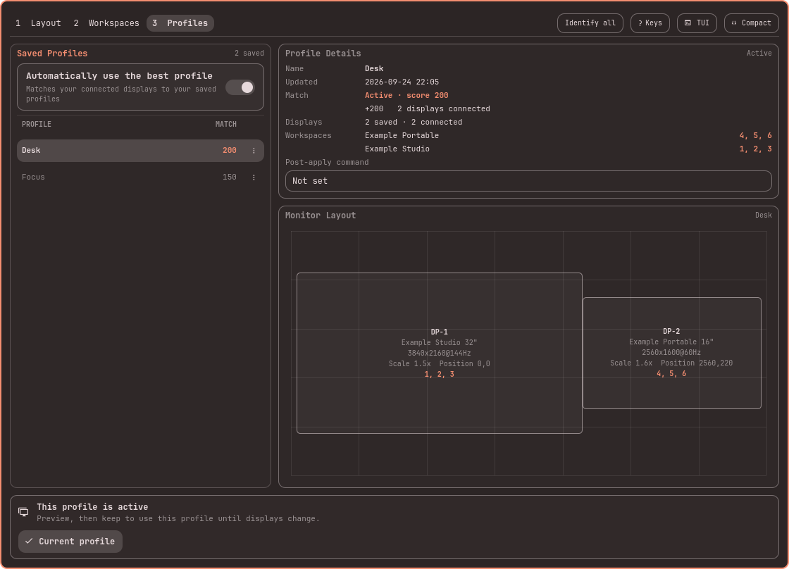
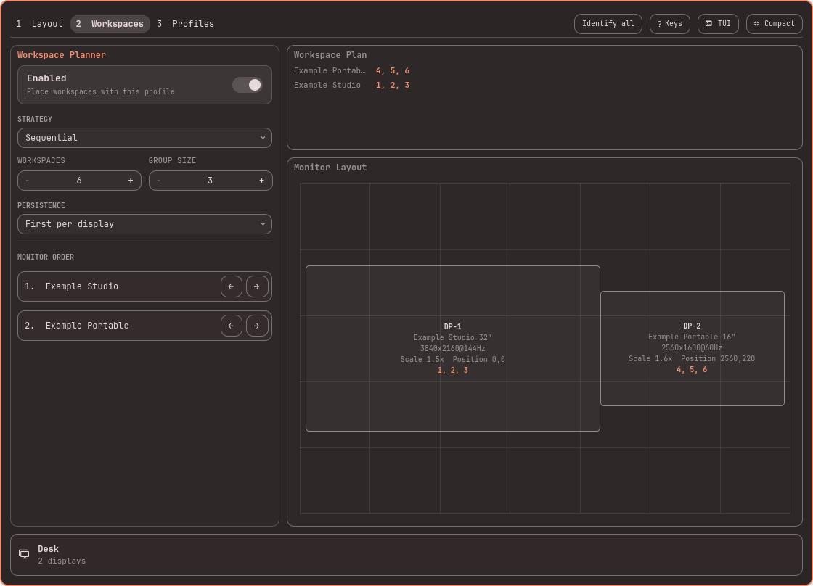

# hyprmoncfg: Multi-Monitor Manager for Omarchy

An Omarchy bar panel for [hyprmoncfg](https://hyprmoncfg.dev/). Create multi-monitor layouts for Hyprland in a visual editor and switch them automatically on hotplug and lid events.



Version 2.4 brings a cleaner Layout / Workspaces / Profiles editor, more discoverable display and profile actions, and refreshes that preserve your edits while displays connect. The compact view keeps everyday controls close; expand it for the spatial editor. The companion TUI shares the core operations and display terminology, with native keyboard-first controls. See the [release notes](design/releases/2.4.0.md) for highlights and remaining differences.

Screenshots show the actual panel with synthetic display/profile data in an isolated capture host, not a live hardware test.

<details>
<summary>See the expanded editor</summary>

### Layout and display controls


### Saved profiles



### Workspace planning



</details>

## Automatically match the right layout to the connected monitors

Set your profiles up once. The desk, with the ultrawide on and the laptop panel off. The dock with three screens. The conference room projector at its own resolution and scale. After that you do nothing. Plug the monitors in and the matching profile is applied. Close the lid and the clamshell layout takes over. Undock and your laptop screen comes back at the scale you picked, with your workspaces where you put them.

It knows your monitors apart by make, model and serial, not by which port they are in. Move a cable from HDMI to DisplayPort and your layout still knows which screen is which. Two identical monitors are told apart by reading the DRM connector directly. The lid switch is read from the kernel, including the Apple SMC lid on a MacBook.

A small background service is what watches for this. It catches hotplug, lid and wake events as they happen, including before the bar has started and coming out of a suspend.

## What it does

**Live controls**

- Per-display brightness for the monitor selected on the layout, using Omarchy's own internal-backlight, DDC/CI, and Apple Display support
- Brightness stays live hardware state rather than being stored in layout profiles, and changes made by Omarchy's panel or brightness keys remain compatible

**Keyboard controls**

- Main pages are now `1 Layout`, `2 Workspaces`, `3 Profiles`; the 2/3 shortcuts have swapped
- Off and mirrored displays have selectable cards; select an off display to edit its Enabled setting
- Profile actions are available with right-click, the visible menu button, or `Shift+F10`; deletion asks for confirmation
- Use a saved profile directly with a 30-second preview; automatic selection need not be disabled first
- Setup status and Create profile are available in compact and expanded views; the expanded header groups Identify all, Keys, TUI, and Compact without duplicating setup text
- Canvas and Identify use connector, model with whole-inch size, resolution/refresh, scale/position, and workspaces without display numbering or logical desktop dimensions; the inspector separates Model and Panel size
- The inspector shows all hardware details directly; live hardware brightness remains in compact mode only
- The companion TUI shares the display-summary conventions; standalone TUI Identify and layout reuse remain pending

- The expanded panel mirrors the TUI shortcuts: `1`/`2`/`3` switch pages, `a` applies, `s` saves, `r` resets, and `?` shows the contextual key guide. On Profiles, **Reuse layout…** (or `u`) opens the layout-reuse form, which uses Tab, arrow keys, and Enter to move through its selectors and buttons.
- On the layout, arrows move the selected display; `Shift`, `Ctrl`, and `Alt` preserve the TUI's fine movement and nearest-display snapping
- Profile browsing and workspace settings use the same arrow, Enter, load, edit, and delete keys as the TUI

**Layout**

- Snap-to-edge arrangement, and the displays beside an output move with it when scale, mode or rotation changes its size
- Per-output scale, checked for whole-pixel sharpness
- Mirroring, rotation and flips
- Positions by hand or by snapping

**Colour and signal**

- Nine colour management presets, from sRGB through wide gamut to HDR
- Forced HDR, forced wide colour, and ICC profile paths
- 8 and 10-bit depth
- SDR brightness, saturation and transfer curve, with luminance floors and ceilings for SDR and HDR
- Variable refresh rate: off, on, or fullscreen only

The colour inspector follows [Hyprland's colour terminology](https://wiki.hypr.land/configuring/core/monitors/colors/) while preserving the underlying fields:

| Panel term | Meaning |
| --- | --- |
| Colour depth (bpc) | Bits per colour component in the output signal |
| Colour space / EOTF | Output primaries plus the electro-optical transfer function; HDR presets use PQ |
| SDR luminance / saturation scale | Unitless adjustment applied to SDR content in HDR mode |
| SDR black / white level | Luminance endpoints, in cd/m², used for SDR-to-HDR mapping |
| Display black / peak / maximum frame-average luminance | Overrides for display luminance metadata normally obtained from EDID |
| WCG / HDR capability | Auto-detect, force off, or force on when hardware detection is wrong |
| ICC device profile | Absolute path to a display characterization profile |

Every editable per-display field gains an individual reset action after it diverges from the loaded profile. Resetting restores that one saved value without discarding unrelated edits. All-zero display luminance overrides leave EDID detection in control.

Neutral SDR multipliers are shown as 1, including profiles that omit them. Resets preserve saved zero/omitted luminance overrides instead of replacing them with generic display defaults. Mode, scale, and rotation resets use the same layout reflow as ordinary edits, so neighboring displays remain aligned.

**Profiles and switching**

- One profile per place you work, applied automatically on hotplug, lid and resume
- Two identical monitors are told apart, and a layout survives moving a cable to another port
- Previewed changes revert unless you confirm within 30 seconds by default
- Failed automatic applies retry with bounded backoff; all-displays-off startup and failed-wake rescue are not yet complete

**Workspaces**

- A workspace planner that lays your workspaces out across the displays in a profile: manual, sequential, or interleaved
- Set how many workspaces there are, how they group, and the monitor order they follow
- Workspace and group counts have no fixed product cap; type an exact large value directly
- Group size appears only for Sequential plans; type an exact workspace count and press `Enter`
- In manual mode, move each numbered workspace directly between displays with the row arrows or keyboard
- Per-monitor workspace rules, saved with the profile and applied with it
- Persistence: First per display or All assigned with hyprmoncfg 1.19.0. Manual rules retain their individual persistence flags.

## Identify screens and reuse a layout

Click a monitor in the compact or expanded layout to identify that physical screen, or choose **Identify all**. The labels use a fresh live snapshot and help distinguish identical monitors without moving windows or changing the layout. The cues last up to four seconds, do not take keyboard or mouse input, and dragging a monitor does not trigger them. One persistent service owns identification from the canvas, inspector, and reuse form, so closing or rebuilding a bar panel does not interrupt the cue. Starting a preview, losing the backend connection, or detecting a changed display setup cancels it. Identify again after the display list refreshes. Unavailable screens show an explanation instead.

Choose **Use an existing layout…** in compact view, or select a profile and choose **Reuse layout…** on Profiles, to adapt a saved layout to the monitors currently connected. Similar monitor models appear first, and any saved layout can be used. Assign each saved role to a current screen; **Identify** beside each assignment helps check which screen is which. Choosing an already assigned screen swaps the two roles. You can leave out an absent saved display.

**Create draft for these monitors** uses the current hardware identities and remaps the layout, mirrors, and workspaces. Extra connected displays stay in the draft. Review any adjustments, choose a new name, then use **Preview & save → Keep & save**. The original profiles remain saved, and creating the draft alone does not apply a layout.

Hotplug refreshes preserve in-progress edits and input. Stale status/editor replies cannot replace a newer topology or preview state; compositor-busy responses retain the last visible snapshot while bounded retries recover.

Editor refreshes wait for an active preview to finish; choosing Discard still resets the draft from a fresh layout.

Layout reuse requires a daemon that advertises the `reuse_profile` capability. The panel explains when that support is unavailable; other controls remain usable. Reusing a layout does not change automatic profile selection.

## Install

```sh
omarchy plugin add https://github.com/crmne/omarchy-hyprmoncfg.git --enable
```

If hyprmoncfg is missing, open the panel and choose **Install hyprmoncfg**. The panel closes before Omarchy opens its presented terminal, so the terminal can receive keyboard input at the password prompt. Installation monitoring continues while the panel is closed. The terminal runs:

```sh
if pacman -Q hyprmoncfg-bin >/dev/null 2>&1; then
  yay -S --needed --cleanafter hyprmoncfg-bin
elif pacman -Q hyprmoncfg >/dev/null 2>&1; then
  yay -S --needed --cleanafter hyprmoncfg
else
  omarchy pkg aur add hyprmoncfg-bin
fi
systemctl --user enable hyprmoncfgd.service
systemctl --user restart hyprmoncfgd.service
setsid -f gtk-launch hyprmoncfg-omarchy >/dev/null 2>&1
```

A fresh install takes `hyprmoncfg-bin`, the ready-made build; a machine that already has either package keeps it and upgrades it directly through `yay` (`hyprmoncfg` builds from source, as the AUR asks of packages under the plain name). Upgrades keep `yay` interactive so the user can review AUR changes. Both commands run in Omarchy's presented terminal, never invisibly inside `omarchy-shell`. After a successful install or upgrade it explicitly restarts the daemon, so an already-running service immediately uses the new binary, then opens hyprmoncfg through its hidden Omarchy desktop launcher. That launcher ships with the main package and carries Omarchy's standard `TUI.float` window identity, so the editor opens centered at the normal floating size without putting Omarchy-specific window logic in the panel. Saving a profile updates the panel immediately over IPC.

## Requirements

- Omarchy Quattro with third-party shell plugins
- hyprmoncfg 1.19.0 or newer

## Staying up to date

Use Omarchy's standard plugin update command to review and install updates:

```sh
omarchy plugin update crmne.hyprmoncfg
```

The panel does not fetch upstream Git commits, change its checkout, or show a permanent update action when no update has been detected. The [marketplace listing](https://plugins.omarchy.org/plugin.html?id=crmne.hyprmoncfg) records the version and exact commit most recently verified for publication; that verification status is informational and is not an update notification.

Upgrading the hyprmoncfg package is a separate matter: installing runs as root and cannot restart a user service, so the previous daemon keeps serving profiles until someone restarts it. When the running daemon is older than the installed binary, the panel offers **Restart daemon**. The hyprmoncfg TUI says the same in its status line, where the message is also the button.

## Remove

### Hand display management back to Omarchy

```sh
hyprmoncfg unmanage
omarchy plugin remove crmne.hyprmoncfg
```

`unmanage` stops automatic switching, removes the hyprmoncfg include from your Hyprland configuration, hands Omarchy's monitor watcher back, and reloads Hyprland. Omarchy or any other display tool can then control your monitor configuration normally.

The daemon remains enabled and running, but this is intentional and harmless: its persisted unmanaged state prevents it from applying profiles or changing your monitor configuration, and it sits idle without using CPU. Run `hyprmoncfg manage` if you want it to take control again.

### Fully uninstall hyprmoncfg

Stopping and removing the daemon is not required after `unmanage`. If you nevertheless want to remove hyprmoncfg completely, run the commands above and then:

```sh
systemctl --user disable --now hyprmoncfgd.service
omarchy pkg drop hyprmoncfg
```

Your saved profiles remain in `~/.config/hyprmoncfg/profiles`.

## Development

The proposed shared workflow and panel direction are documented in [DESIGN.md](DESIGN.md),
with an [interactive design study](design/monitor-manager.html). These describe
planned improvements, not additional capabilities in the current release.

The confirmation service controls previews it starts itself, and can recover a
preview when the daemon reports that its original client disconnected. A live
TUI keeps its own confirmation. This recovery requires the daemon's
`preview.reclaimable` status field. The required hyprmoncfg 1.19.0 backend also keeps
Omarchy's lock/wake handling aligned with the active laptop scale and position.

After changes to preview handling, test position and scale changes, disabling
the panel's own display, keyboard and mouse confirmation, timeout rollback, and
opening the TUI while the plugin is enabled. The automated tests exercise socket
message ordering; monitor remapping and keyboard focus also need a live session.
Also verify that the installer terminal accepts keyboard input, field resets
return to their loaded values without discarding other edits, and identical
saved layouts show the confirmed current profile consistently.

```sh
node --test tests/*.test.js
qmllint *.qml
QT_QUICK_BACKEND=software /usr/lib/qt6/bin/qmltestrunner -platform offscreen -input tests/qml
omarchy plugin validate .
git diff --check
```
